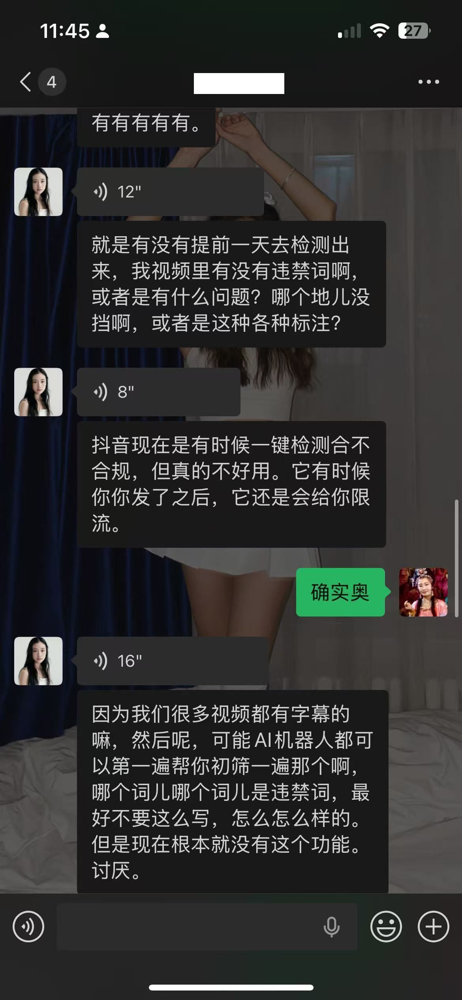
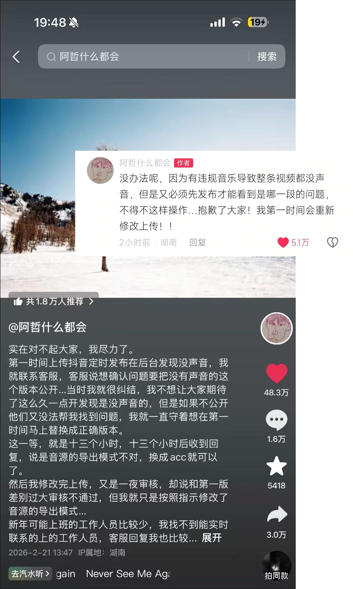

# AI 审查 · Content Compliance Check
### TikTok / 抖音 创作体验功能设计 · Vibe Coding 原型

  
  
  

---

## 一、思路起源

<table>
  <tr>
    <td width="72%" valign="top">

### 🎙️ 用户访谈

在深入体验 TikTok 创作链路后，  
我对身边的创作者朋友进行了访谈。

一位拥有数万粉丝的博主朋友说：

> “每次发完就会频繁查看自己的流量数据，如果有数据出奇不好的，  
> 我们就会怀疑是不是自己的内容有什么违禁词被限流了。  
> 希望有一个机器人之类的帮我们审查一遍违禁词。”

    </td>
    <td width="28%" align="right" valign="top">
      
    </td>
  </tr>
</table>

 

<table>
  <tr>
    <td width="68%" valign="top">

### 📡 行业观察

2025 年春节期间，某头部博主  
发布了一条精心制作的长视频，  
但因背景音乐未通过抖音版权审核，  
被迫先发布 **无声版本**，  
完整版转至 B 站发布。  
这一操作意外为 B 站  
带来了大量跨平台流量。

这件事让我意识到一个结构性问题：

**创作者在发布前对内容的合规状态几乎完全没有感知。  
所有反馈往往都发生在发布之后：  
视频被删了、被限流了、数据崩了，  
才知道出了问题。**

    </td>
    <td width="32%" align="right" valign="top">
      
    </td>
  </tr>
</table>

### ❓ 设计问题

**能否在内容创作完成后，借助 AI 审查内容是否存在违规风险（文字、画面、声音等），让创作者在发布前主动知道？**

---

## 二、产品概述

### 2.1 产品定义

**AI 审查（Content Compliance Check）** 是集成在 TikTok / 抖音创作界面的实时合规预检模块。

调用平台现有的内容审核 AI 能力，以更可视化、更可感知的方式，在发布前为创作者提供内容合规状态的预判。

### 2.2 核心价值主张

将「**事后惩罚型**」审核体验，转化为「**事前赋能型**」创作辅助体验。

不改变审核标准，只是把平台已有的检测能力提前开放给创作者，让他们在发布前主动知道内容是否安全。

> [!WARNING]
> **功能定位说明**  
> 本功能 **不替代** 平台正式审核流程。  
> 平台审核以实际发布后的结果为准。  
> AI 审查的定位是帮助创作者在发布前 **主动排雷**，而非提供任何形式的“过审保证”。

### 2.3 检测维度

| 维度 | 检测内容 |
|------|----------|
| 🎬 视觉内容 | 逐帧扫描画面中的违规元素，如物体、场景、符号等 |
| 🎵 音频轨道 | 版权指纹匹配、违规声音识别、受限地区检测 |
| 📝 文字内容 | 字幕、贴纸、发布文案中的敏感词与话题标签 |

### 2.4 产品范围

#### Phase 1 · 当前原型覆盖

- AI 审查入口图标：集成于右侧工具栏，采用双圆品牌色视觉表达
- 扫描动效系统：以代码雨形式可视化 AI 思考过程
- 分析进度面板：多步骤展开，实时反馈当前检测状态
- 草稿后台模式：扫描过程中可退出当前页面，结果完成后回到主流程
- 合规通过结果页：以健康分与庆祝反馈鼓励继续发布
- 风险结果页：精准定位问题片段，并支持一键进入修复链路

#### Phase 2 · 规划中

- 动效系统深化：包括 AI 审查 icon 动效与扫描表现的进一步打磨
- 品牌内容合规标注自动提示
- AI 生成内容检测与标注引导

---

## 三、原型演示

🔗 **[点击查看原型](https://tik-tok-content-review.vercel.app/)**

> 推荐使用 Chrome 浏览器打开，以获得最佳体验效果。

---
